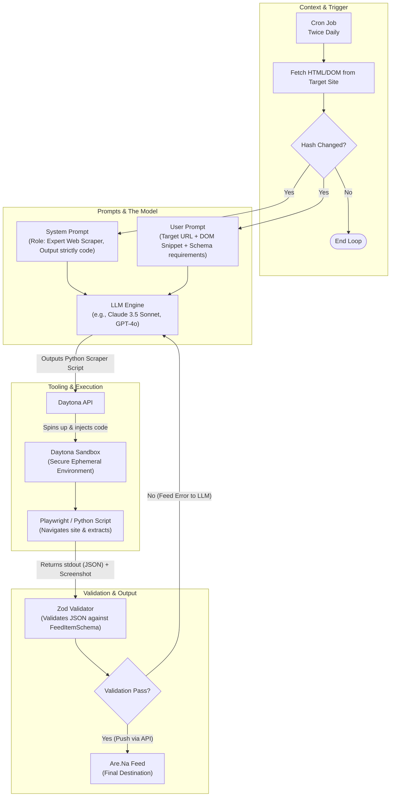

# 04 - The Ingestion Agent

## Overview
The Ingestion Agent is the intelligent orchestrator that checks sites for updates, generates extraction code when changes occur, and structures the output. It runs on a scheduled cadence and leverages Daytona for secure code execution.

## Agent Setup & Architecture Diagram
This diagram outlines the context, the prompts provided to the model, the exact tooling required, and the logical flow of data.



## Polling Cadence
*   **Schedule:** The agent is triggered via a cron job **twice a day** (e.g., morning and evening).
*   **Why:** This strikes a balance between keeping the feed fresh and minimizing LLM/Daytona infrastructure costs, while also avoiding aggressive polling that could burden target websites.

## The Agent Flow

When the scheduled polling triggers, the agent follows a strict state machine for each monitored URL:

### 1. Change Detection
Before initiating complex LLM queries or heavy scraping operations, the agent first verifies if the site has actually been updated.
*   **Method:** The system fetches a lightweight snapshot of the URL (e.g., raw HTML or just the text content of the `<body>`).
*   **Comparison:** It compares the current snapshot's hash against the hash from the last successful ingestion.
*   **Decision:**
    *   **No Change:** The loop ends immediately. The agent sleeps until the next scheduled run.
    *   **Change Detected:** The agent proceeds to code generation.

### 2. Code Generation
Once a change is confirmed, the agent analyzes the new DOM structure and writes a bespoke script to extract the latest update.
*   **Prompting:** The LLM receives the new HTML snippet and is instructed to write an executable script (e.g., Python Playwright or Node Puppeteer).
*   **Goal:** The script's objective is to extract only the *newest* item (the latest blog post, project, or announcement) rather than the entire page.

### 3. Execution in Daytona Sandbox
LLM-generated code should be treated as untrusted and potentially unstable. 
*   **Provision:** The agent orchestrator calls the Daytona API to instantly spin up an isolated, ephemeral sandbox environment.
*   **Execute:** The generated scraper script is injected into the Daytona workspace and executed.
*   **Capture:** The script navigates to the page, parses the DOM, takes the required screenshot, and prints the result to standard output (stdout).

### 4. Structured Output Validation
To ensure the chronological feed (Are.Na) remains consistent and visually appealing, the output from the Daytona sandbox must strictly adhere to a predefined schema. 
*   **Zod Schema:** The backend validates the script's JSON output using a Zod schema before processing it further.

```typescript
import { z } from "zod";

export const FeedItemSchema = z.object({
  title: z.string().min(1).describe("The main title of the new update or post."),
  subtitle: z.string().optional().describe("A short summary, excerpt, or subtitle."),
  screenshot_base64: z.string().describe("Base64 encoded string of the screenshot taken by the script."),
  post_url: z.string().url().describe("The direct permalink to the specific update, if available.")
});

export type FeedItem = z.infer<typeof FeedItemSchema>;
```

*   **Ingestion:** If the output satisfies the `FeedItemSchema`, the backend logs the new hash (for future change detection) and pushes the content block to the Are.Na feed.
*   **Self-Healing:** If the Zod validation fails (e.g., the script missed the title), the agent can feed the validation error back to the LLM for an automatic retry inside Daytona.
